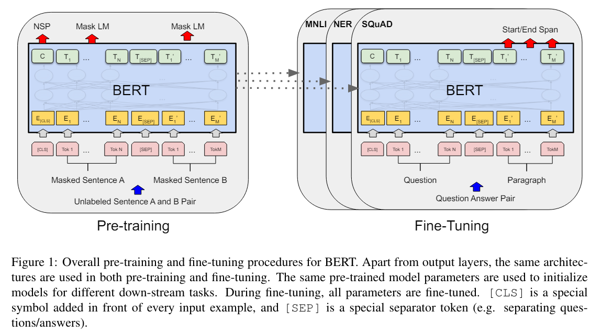

# [BERT: Pre-training of Deep Bidirectional Transformers for Language Understanding](https://arxiv.org/abs/1810.04805)
* 2018년에 구글이 공개한 사전 훈련된 모델   
* Bert는 Bidirectional Encoder Representations from Transformers 약자로 트랜스포머를 이용한 양방향 인코더 표현의 뜻.
* BERT는 모든 레이어에서 좌우 문맥을 동시에 고려하여 비지도 학습을 통해 심층 양방향 표현을 사전 학습하도록 설계.
* 사전 학습된 BERT 모델은 추가적인 출력 레이어 하나만으로도 미세 조정되어, 특정 아키텍처를 크게 변경하지 않고도 질문 응답 및 언어 추론과 같은 다양한 작업에 대해 최첨단 모델을 만들 수 있다.

## Introduce
