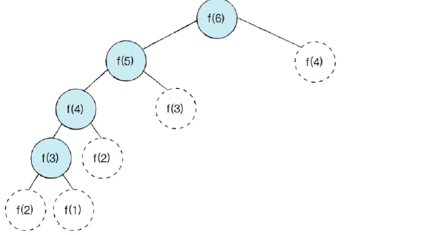

# 다이나믹 프로그래밍
----
* 동적 계획법, DP
* 최적화 이론 중 하나.
    * 특정 범위까지의 값을 구하기 위해 다른 범위의 값을 이용해서 효율적으로 값을 구하는 알고리즘 설계 기법.
    * 하나의 큰 문제를 여러 개의 작은 문제로 나누어 그 결과를 저장하여 큰 문제를 해결할 때 사용.
    * 일종의 답을 재활용.(기억하며 풀기)
* 최적 부분 구조의 문제와 겹치는 부분 문제를 효율적으로 풀 수 있음.
    * 최적 부분 구조(Optimal Substructure) : 작은 문제들의 최적 결과 값을 이용해 전체 문제의 최적 결과를 낼 수 있는 경우.  
    
    * 겹치는 부분 문제(Overlapping Subproblems) : 동일한 작은 문제들이 반복하여 나타나는 경우.

</br>

## 접근
---
* 예시 : 피보나치 수열.
    * $n$번째 피보나치 수 = n-1번째 피보나치 수 + n-2번째 피보나치 수$
    * 단 첫번째, 두번째는 = 1  


<br>

* 이를 재귀로 구현 하면 아래와 같음.
```python
def fibo(x):
    if x ==1 or x==2:
        return 1
    retirn fibo(x-1)+fibo(x-2)
print(fibo(4)) # 4번째 피보나치 수열의 경우.
```
* 위의 재귀함수는 n이 커지게 될수록 수행시간이 매우 늘어남.
* 시간 복잡도를 $O(2^N)$라 애기함.
    * Exponential Explosion
    * 위에서 6을 계산하기 위해 더하기 연산이 7번 일어남.

<br>

* 피보나치 문제 살펴보기
    * 작은 문제들이 반복됨.
        * F(5)를 구하기 위해 F(4), F(3)이 필요하고, F(4)를 구하기 위해 F(3)과 F(2)가 반복됨.
    * 같은 문제는 정답이 동일함
        * F(3)을 어디에서 구하는 결국에 정답은 동일하게 이루어짐.
    * 위 두가지로 봤을 때 동적 계획법을 사용할 수 있다!

<br>

* Memorization
    * DP 구현 방법 중 한 종류
    * 결과를 메모리 공간에 저장 후 다시 호출해서 그 결과를 가져오는 기법
        * 한 번 계산한 작은 문제를 저장해 놓고 다시 사용하는 기법.
* 예시
```Python
# 한 번계산한 결과 저장을 위한 리스트 초기화
d = [0] * 100

# 구현(top-down)
def fibo(x):
    if x ==1 or x==2:
        return 1
    # 이미 계산한 적 있는 문제라면 그대로 변환
    if d[x] != 0:
        return d[x]
    d[x] = fibo(x-1)+fibo(x-2)
    return d[x]
print(fibo(6))
```
* 위의 재귀함수는 n이 커지게 되도 수행시간이 얼마 걸리지 않음.
* 시간 복잡도 $O(N)$
    * 위에서 6을 구하기 위해 더하기 연산이 4번 일어남.


<br>

## 구현
---
* Top-down: 하양식
    * 큰 문제를 해결하기 위해 작은 문제를 호출(재귀)
    * Meorization이라고도 불림.
* Bottom-up: 상향식
    * 반복문을 통해 작은 문제부터 차근차근 답을 도출하여 큰 문제까지 해결.
    * Bottom-up에서 사용된 list는 `DP 테이블`이라고 불림.
    * Tabulation이라고도 불림
        * dp[0]부터 하나씩 채우고(Table-filing)
        * Table에 저장된 값에 직접 접근하여 활용.
* Tip!
    * 재귀로 문제를 풀고 Memorization을 이용해서 Top-down으로 풀거나
    * Bottom-up을 먼저 시도
        * 재귀함수의 경우 최대 깊이가 정해져 있음.


```python
# bottom-up
d = [0]*100
d[1], d[2] = 1, 1
n = 99

for i in range(3, n+1):
    d[i] = d[i-1]+d[i-2]
print(d[n])
```

<br>

## 순서
---
1. 이게 DP 유형인가?
    * 완전 탐색으로 풀었을 때 시간이 너무 오래 걸리면 의심해보자.
    * 겹치는 부분 문제 or 최적 부분 구조인지 확인.

<br>

2. 문제의 변수 파악.
    * DP는 현재 변수에 따라 그 결과 값을 찾고 재사용.
    * 문제의 변수의 개수를 알아야함.
    * 피보나치에서는 fibo(n)에서 n이 변수!

<br>

3. 변수 간 관계식 만들기.
    * 변수에 의해 결과는 달라지지만, 같은 변수라면 결과는 동일함.
    * 관계식을 만들 수 있어야함.
        * 점화식
        * 반복/재귀를 통한 해결이 가능.
    * 피보나치
        * $f(n)=f(n-1)+f(n-2)$

<br>

4. 저장하기
    * 변수에 따른 결과를 저장해야함.
    * 저장할 배열을 미리 만들고, 그 결과를 나올 때마다 배열 내에 저장하고 그 저장된 값을 재사용하는 방식으로 문제 해결.
    * 상황에 따라 리스트, 딕셔너리 등을 사용할 수 있음.
        * 결과 값에 따라 차원이 달라질 수 있음.

<br>

5. 기저 상태 파악
    * 가장 작은 문제의 상태에 대해 알아야함
    * 직접 손으로 테스트하여 구성
    * 파악 후 미리 배열 등에 저장.
    * 피보나치
        * n=0, n=1, n=2일 때 상태 파악.

<br>

6. 구현
    * Top-down
        * 재귀
    * Bottom-up
        * 반복문

# 문제
---


1. 이게 DP?
    * BFS아닌가?
    * 같은 문제들이 반복적으로 일어남.
        * 5나누기, 3나누기, 2나누기, 1빼기
<br>

2. 변수는?
    * n

<br>

3. 변수 간 관계식 만들기.
    * $dp[n] = min(dp[n/5], dp[n/2], dp[n/3], dp[n-1])+1$

<br>

4. 저장하기
    * `1<=n<=30,000`
    * 총 3만개의 저장 공간이 필요.

<br>

5. 기저 상태 파악
    * 점화식 $dp[n] = min(dp[n/5], dp[n/2], dp[n/3], dp[n-1])+1$
    * DP[1] = 0
    * DP[2] = 1
    * DP[3] = 1
    * DP[4] = 2
    * DP[5] = 3
    * DP[6] = 2

<br>

6. 구현
* Bottom-up
```python
n = int(input())
# 저장 공간 선언
dp = [0]* 30001

# 구현
for i in range(2, x+1):
    # 기본 조건은 -1
    dp[i] = dp[i-1] + 1
    if i%2 ==0:
        dp[i] == min(dp[i], dp[i//2]+1)
    if i%3 ==0:
        dp[i] == min(dp[i], dp[i//3]+1)
    if i%5 ==0:
        dp[i] == min(dp[i], dp[i//5]+1)

# 결과 출력
print(dp[i])
```