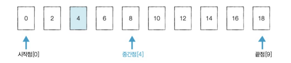
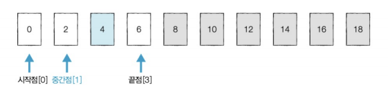
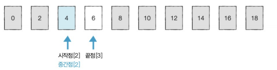
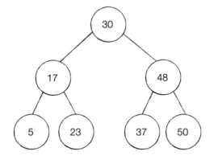
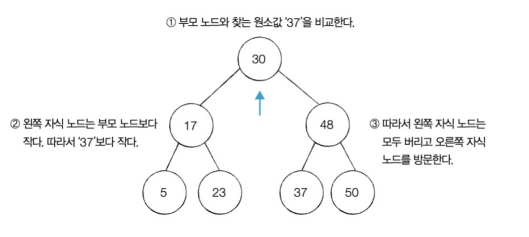
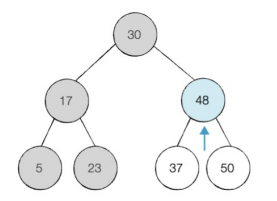
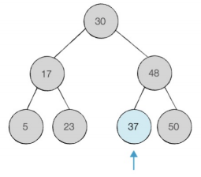

# 이진 탐색 알고리즘.
---
* 순차 탐색
* 이진 탐색
* 이진 탐색 트리(+트리 구조)

<br>

## 순차 탐색
---
* 리스트 안에 특정한 데이터를 찾기 위해 앞에서부터 데이터를 하나씩 차례대로 확인.
* 말 그대로 순차적으로 데이터를 탐색.
* `count()`의 매소드도 순차탐색이 수행.
* 시간복잡도 : $O(N)$

<br>

## 이진 탐색
---
* 반으로 쪼개면서 탐색.
* 오름차순으로 정렬된 리스트에서 특정한 값의 위치를 찾는 알고리즘
* 검색이 반복되면 범위가 절반으로 감소해 속도가 매우 빠름.
* 보통 탐색 범위가 큰경우 사용.
* 시간복잡도 : $O(logN)$ 

</br>

* 구현
    * 반복 or 재귀
    * 시작점, 끝점, 중간점 사용. $중간점 = 끝점//2$
        * 찾으려는 데이터와 중간점의 위치에 있는 데이터를 반복적으로 비교
    * 배열의 중간 값 설정.
    * 중간 값과 원하는 값과 비교.
        * 같다면 종료.
        * 중간값이 더 크면 중간값의 왼쪽 구간 탐색
        * 중간값이 더 작으면 중간값의 오른쪽 구간 탐색.
    * 값을 찾거나 간격이 비어있을 때까지 반복
        * 간격이 비어진 경우 원하는 값이 없는 경우.

</br>

* 예시(4를 찾는 경우)
    * 시작점, 끝점, 중간점 설정 및 중간값과 원하는 값 비교  
    
    * **중간값>원하는 값**이므로 왼쪽구간 탐색 및 끝점, 중간점 재설정 및 값 비교  
    
    * **중간값<원하는 값**이므로 오른쪽구간 탐색 및 시작점, 중간점 재설정 및 값 비교  
    

</br>

* 재귀
``` Python
def binary_search(array, target, start, end):
    if start>end:
        return None
    mid = (start+end) //2

    # mid == target
    if array[mid] == target:
        return mid
    # mid > target
    elif array[mid] > target:
        return binary_search(array, target, start, mid-1)
    # mid < target
    else:
        return binary_search(array, target, mid+1, end)

n, target = list(map(int, input().split()))
array = list(map(int, input().split()))

# 이진 탐색 수행 결과 출력
result = binary_search(array, target, 0, n-1)
if result == None:
    print('원소가 존재하지 않음')
else:
    print(result+1) # index 반환이므로 위치는 +1을 해줘야함.
```

* 반복문
``` Python
def binary_search(array, target, start, end):
    while start <= end:
        mid = (start+end) // 2
        # mid == target
        if array[mid] == target:
            return mid
        # mid > target
        elif array[mid] > target:
            end = mid -1
        # mid < target
        else:
            start=mid +1
    return None

n, target = list(map(int, input().split()))
array = list(map(int, input().split()))

# 이진 탐색 수행 결과 출력
result = binary_search(array, target, 0, n-1)
if result == None:
    print('원소가 존재하지 않음')
else:
    print(result+1) # index 반환이므로 위치는 +1을 해줘야함.
```

## 이진 탐색 트리
---
* 각 노드가 최대 두 개의 자식을 갖는 트리
* 이진 탐색이 동작할 수 있도록 고안된, 효율적인 탐색이 가능한 자료구조.
    * 보통 데이터를 많이 사용(1000만~1억)
    * `input()` 대신 `sys.stdin.realine()`사용
* 모든 트리가 이진 트리가 아님.  


</br>

* 특징:
    * **왼쪽 자식 노드 < 부모노드 < 오른쪽 자식노드**
    * 부모노드보다 왼쪽의 자식 노드가 작다.
    * 부모노드보다 오른쪽의 자식 노드가 크다.

</br>

* 예시(37를 찾는 경우):
    * 루트 노드와 찾는 값과 비교  
    
    * 오른쪽으로 방문 및 값 비교  
    
    * 왼쪽으로 방문 및 값 비교  
    