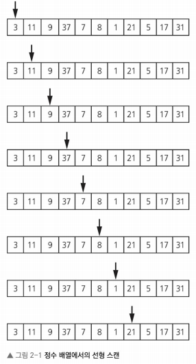
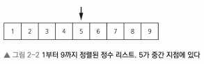

# 이진탐색(Binary Search)
* 이진 탐색 정렬된 리스트에서 특정 값을 빠르게 찾는 알고리즘이다.
* 기본적으로 리스트를 반으로 나눠 target값이 어느 절반 쪽에 속하는지 결정하고, 나머지 절반은 버리면서 target값이 포함될 가능성이 있는 절반을 탐색하는 방식으로 동작.
* 이진탐색은 연결 리스트, 배열 그외의 여러 트리 기반 알고리즘과 같은 데이터 저장 기법들의 차이점을 살펴볼수 있다.

## 선형 탐색
* 이진 탐색의 이점에 대해 이해하기 위해 비교를 위해 선형 탐색에 대해 알아보자.
* 선형 탐색은 리스트에서 한 번에 하나씩 target값과 비교하면서 target값을 찾거나 목록의 끝에 도달할 때까지 비교해 target값을 찾는다.

* 관련 sudo code
```
LinearScan(Array:A, Integer: target):
  Integer: i = 0
  WHILE i < length(A):
    IF A[i] == target:
      return i
    i = i + 1
  return -1
```
* While 루프를 통해 배열의 각 원소를 반복하고, if문을 통해 해당 인덱스에 해당하는 배열 값을 target 값과 비교하여, 찾은 경우 해당 인덱스를 반환.
* 만약, target를 찾지 못하고 끝까지 진행되면 -1를 반환.
* target 21을 찾는 과정을 보면 다음과 같다.  
  
* 위의 과정을 보면, 매우 비효율적인 것을 알 수 있다.
* 특히, 리스트의 길이가 길어지면 길어질수록 시간이 더 오래 걸린다는 것을 알 수 있다.

## 이진 탐색 알고리즘
* 이진 탐색은 __정렬된__ 리스트에서 target값을 찾는 알고리즘으로, 정렬된 데이터에서만 작동한다.
* 리스트를 반으로 분할 후 target 값이 어디 반에 속하는 찾고나서, 나머지 절반은 버리는 과정을 반복하여 마지막 값을 찾음.
* 아래 그림은 7를 찾는 경우를 보여준다.  
  
    * 중앙값인 5을 보고 7은 오른쪽 절반에 해당되는것을 알 수 있고, 1~5에 해당되는 경우를 버릴 수 있다.

* 이처럼 이진 탐색 알고리즘은 배열이 __오름차순으로 정렬되어__ 있음을 이용.
    * 이러한 정렬된 정보를 통해 배열의 불필요한 부분을 모두 제거할 수 있다.

* 이진 탐색은 중앙값을 선택하면서 시작된다.
`IndexMid = Florr
