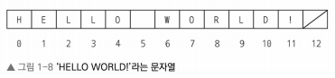
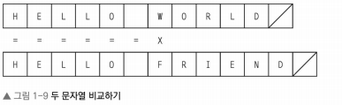

> 읽고 나면 진짜 쉬워지는 자료구조 책의 내용을 기반으로 정리했습니다
[책 구매링크](https://product.kyobobook.co.kr/detail/S000212705529)

# 문자열
* 문자열은 특수한 종류의 배열로 생각할 수 있는, 순서가 지정된 문자의 리스트.
* 언어에 따라 `/`를 이용해 문자열의 끝을 나타냄.  
  
* 일부 언어에서는 문자열을 배열로 직접 구현한다.
    * 문자열이 객체일 수 있다.
    * 실제로 파이썬과 같은 언어에서는 배열과 비슷한 방식으로 인덱스나 슬라이싱 연산한다. 

## 동등성 검사.
* `==`으로 한번에 직접 비교할 수 있는 정수와는 달리, 문자열은 각 문제를 반복하면서 비교해야한다.
* 두 문자열을 비교할 때, 서로 일치하지 않는 문자를 발견할 때까지 두 문자열에서 같은 위치에 존재하는 문자를 서로 비교한다.
* 진행 방식
    * 가장 먼저 동등성 검사를 진행할 두 문자열의 길이를 확인하고, 진행한다.
    * 각 위치를 반복하면서 해당 위치에 있는 두 문자들을 비교.
    * 두 문자가 서로 일치하지 않으면, 루프를 중지.
    * 모든 문자들을 비교했을때 불일치가 일어나지 않았다면, 두 문자열은 같다고 선언할 수 있다.

* sudo 코드로 보면 다음과 같다.
```
StringEqual(String:str1, String:st2):
  IF length(str1) != length(str2):
    return False
  Integer: N = length(str1)
  Integer: i = 0
  WHILE i < N AND str1[i] == str2[i]:
    i = i +1
  return i == N
```

* 실제 작동 확인  
  

* 동등성 검사의 계산 비용은 문자열의 길이에 비례해 증가한다.
* 실제로 짧은 두 문자열을 비교할때는 상관없지만, 서로다른 책 2권을 비교한다고 생각하고, 가장 마지막에 가서 다르다면 엄청나게 많은 비용을 소모해야한다.
* 파이썬에서는 직접 비교할 수 잇는 문자열 클래스는 제공하지만, 그 안에는 모든 문자에 대해 반복하는 루프가 존재한다.

* 어떤 문자에서든, worst-case에 대해서는 모든 문자열을 비교해야하는 이 비용에 대해 과소평가해선 안된다.

