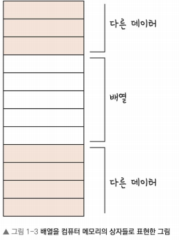
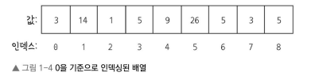
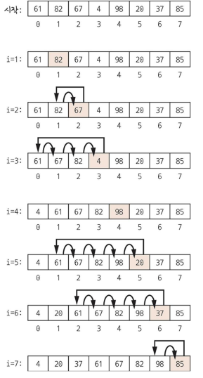

# 배열
* 배열(array)는 관련된 다수의 값을 저장할 때 사용.
* 여러 값을 연속적으로 인덱스(index)가 부여된 상자에 저장한는 간단한 매커니즘을 제공.  

* 컴퓨터 메모리에서는 위 그림과 같이 같은 크기의 상자들이 연손적으로 배치된 불록같은 느낌으로 어떤 메모리 덩어리를 차지하며 임의의 다른 정보와 인접할 수 있다.
* 배열에는 숫자, 문자, 포인터 또는 다른(크기가 정해져 있는)자료 구조와 같은 타입의 값을 저장할 수 있다.


## 접근법
* 배열의 구조는 위치(index)를 지정하여 각 원소에 접근할 수 있다.
* 배열 내 상자들은 메모리에서 서로 인접해 있어 첫번째 원소로부터 offset를 계한해 해당 위치의 메모리를 읽는 방식으로 각 상자에 접근한다.
    * 상자 위치에 상관없이 덧셈과 메모리의 접근있다면 어떠한 정보도 읽을 수 있다.

* 예시로 배열 A가 있다고 생각하면, 대부분의 프로그래밍 언어는 배열의 시작 index가 0부터 시작하는 zero-based index를 사용한다.  
  
* 각 요소의 위치는 다음과 같은 수식으로 계산할 수 있다.
$$ 찾으려고 하는 위치 = 배열의 시작 + 각 원소의 크기 * i$$


## 삽입 정렬(insertion sort)
* 배열의 구조를 더 자세히 이해하기 위해 배열을 정렬시키는 삽입 정렬에 대해 살펴보자.
* 삽입 정렬은 배열의 일부를 정렬하고, 이 정렬된 범위를 전체 배열이 정렬될 떄까지 확장하는 알고리즘이다.

* 오름차순으로 정렬하는 방법은 다음과 같다
    1. 배열의 잘못된 지점(i) 배열의 처음부터 찾기.
    2. 0~i 번째까지 부분 정렬 잘 되어있으므로, i+1의 값과 부분 정렬된 부분을 일일히 비교하면서 i+1의 올바른 위치를 찾는다.
    3. 나머지 원소를 뒤로 이동시켜 선택한 원소가 들어갈 원소의 공간을 만든 후 삽입.
    4. 배열 전체가 정렬되도록 1~3의 과정을 반복.

* sudo 코드르 보면 다음과 같다.
```
InsertionSort(array: A):
    Integer:N = length(A) # 길이 확인
    Integer:i = 1 # 시작 위치
    WHILE i < N: 
        Type:Current = A[i] 
        Integer:j = i-1
            WHILE j >= 0 AND A[j] current:
                A[j+1] = A[i]
                j = j -1
            A[i+1] = current
            i = i + 1
```
* 위에 과정을 시각화해서 보면 다음 그림과 같다.  
  

* 삽입 정렬은 효율적이지 않다. 실제로 worst-case의 경우의 시간복잡도는 O(N^2)으로 매우 크다.
* 하지만, 삽입 정렬은 index를 사용해 원소에 직접 접근, 새 원소를 삽일할 때 값을 교환해야하고, 모든 원소를 반복할 수 있어야 하는 배열의 여러 특성을 확인할 수 있다.