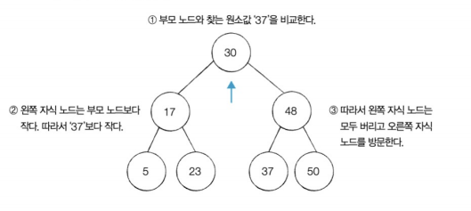
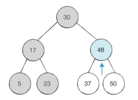
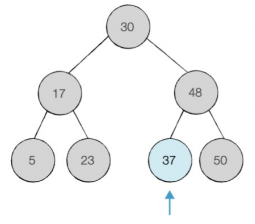

# 트리
---
* 노드로 이루어진 자료 구조.  
* 그래프의 한 종류로 최소 연결 트리라고도 불림.
* N개의 노드는 N-1개의 간선을 가짐.
* 트리에서 일부를 떼어내도 트리구조(서브트리)
* 큰 데이터를 사용하는 경우 트리구조를 사용해 이진 탐색과 같은 기법을 이용해 빠른 탐색이 가능.
      

    [출처](https://namu.wiki/w/%ED%8A%B8%EB%A6%AC(%EA%B7%B8%EB%9E%98%ED%94%84))

 

* 구성 요소
    * 노드(node) : 트리를 구성하는 기본요소
        * 루트 노드(root node) : 트리의 시작점, 최상위 노드
        * 부모 노드(parent node) : 루트 노드 방향으로 직접 연결된 노드
        * 자식 노드(child node) : 루트 노드 반대방향으로 직접 연결된 노드
        * 형제 노드(siblings node) : 같은 부모 노드를 갖는 노드들
        * 단말 노드(leaf node) : 자식이 없는 노드
    * 간선(edge): 노드를 연결하는 선
    * 노드의 특징
        * 노드의 크기(size) : 자신을 포함한 모든 자손 노드의 개수
        * 노드의 레벨(level) : 루트 노드로부터 노드까지 연결된 간선수의 합.
        * 노드의 높이(height) : 가장 긴 루트 경로의 길이
        * 노드의 깊이(depth) : 루트 경로의 길이
        * 노드의 차수(degree) : 각 노드의 자식의 개수(하위 트리 개수)

## 이진 탐색 트리
---
* 각 노드가 최대 두 개의 자식을 갖는 트리
* 이진 탐색이 동작할 수 있도록 고안된, 효율적인 탐색이 가능한 자료구조.
    * 보통 데이터를 많이 사용(1000만~1억)
    * `input()` 대신 `sys.stdin.realine()`사용
* 모든 트리가 이진 트리가 아님.  

 

* 특징:
    * **왼쪽 자식 노드 < 부모노드 < 오른쪽 자식노드**
    * 부모노드보다 왼쪽의 자식 노드가 작다.
    * 부모노드보다 오른쪽의 자식 노드가 크다.

 

* 예시(37를 찾는 경우):
    * 루트 노드와 찾는 값과 비교  
    
    * 오른쪽으로 방문 및 값 비교  
    
    * 왼쪽으로 방문 및 값 비교  
    