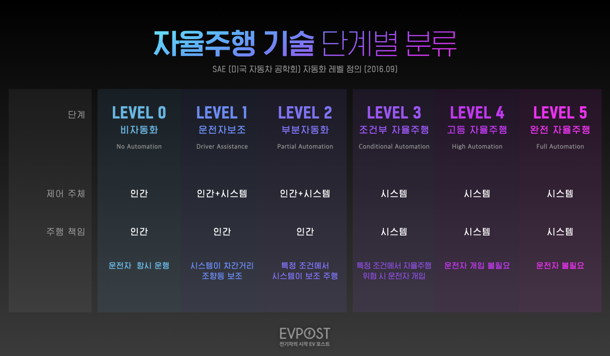

# What is ADAS
* ADAS는 Advanced Driver Assistance System의 약자로 한국어로는 첨단 운전자 보조 시스템이다.
* 센서나 카메라가 위험사항은 감지하여 사고의 위험을 운전자에게 경고하고 운전자가 판단하여 대처할 수 있도록 도와주는 능동형 안전장치.
* 충돌 방지 및 자동 주차와 같은 기능을 제공하며 운전자에게 안전하고 효율적인 운전 환경을 제공.

## 자율주행과의 차이점?
* 기본적으로 ADAS는 운전자를 보조하는 기술로, 운전자가 주체가 되어 주행이 이루어지기 때문에 운전에 대한 궁극적인 책임은 인간 운전자에게 존재한다.
* 자율주행은 기본적으로 무인 주행을 궁극적 목표로 추구하는 기술로, 차량 스스로 주행 환경을 인식하고, 판단하여 제어하는 기술.

* 자율 주행 기술 단계별 분류.

[이미지출처](https://www.evpost.co.kr/wp/%EC%9E%90%EC%9C%A8%EC%A3%BC%ED%96%89-%EB%A0%88%EB%B2%A8%EB%B3%84-%EC%B0%A8%EC%9D%B4-%EC%89%BD%EA%B2%8C-%EC%A0%95%EB%A6%AC%ED%96%88%EC%96%B4%EC%9A%94/)
* 궁극적으로 제어 주체와 주행 책임이 시스템이 되도록하는 것이 목표이다.

## ADAS의 기술.
1. 전방 충돌 경고(FCW) 및 자동 긴급 제동(AEB):
    * 전방 충돌 경고(FCW): 레이더, 라이다, 카메라 등을 이용하여 전방 차량과의 거리를 감지하고, 충돌 위험이 있을 경우 운전자에게 경고음이나 시각적 신호를 제공합니다.
    * 자동 긴급 제동(AEB): FCW가 작동한 후에도 운전자가 적절한 조치를 취하지 않을 경우, 차량 스스로 브레이크를 작동시켜 충돌 피해를 최소화합니다.  

- 차선 유지 보조 시스템 (LKAS: Lane Keeping Assist System)
    - 카메라를 이용하여 차선을 인식하고, 차량이 차선을 이탈하지 않도록 조향을 보조
    - Hough Transform, CNN 등을 활용한 차선 인식 알고리즘 학습
- 스마트 크루즈 컨트롤 (SCC: Smart Cruise Control)
    - 전방 차량과의 거리를 유지하며 일정 속도로 주행하는 기능
    - 레이더, 라이다 등 센서를 활용한 거리 측정 및 객체 추적 알고리즘 학습
- 자동 긴급 제동 시스템 (AEB: Autonomous Emergency Braking)
    - 전방 충돌 위험을 감지하고 자동으로 제동하는 기능
    - 객체 검출 및 추적, 위험 상황 판단 알고리즘 학습