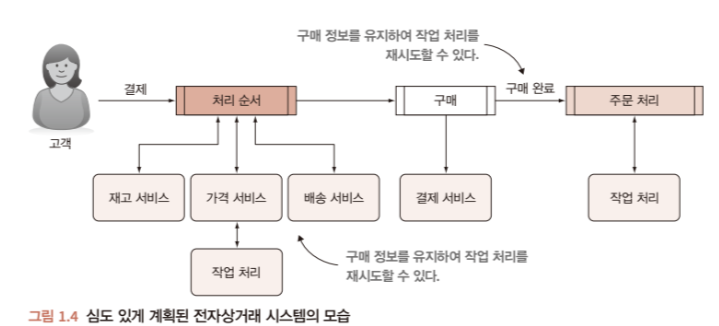

# 프로그래머를 위한 파이썬 - 1장 
>지금까지는 단순히 파이썬을 활용하는 단계였다면, 큰 그림과 상속 등 파이썬에 통달하기 위해 이 책을 선택하였다.  
[책 링크](https://product.kyobobook.co.kr/detail/S000001942513)

## 소프트웨어 설계의 고려 사향.
* user를 위한 software를 제작해도 실제로 사용하는 사람은 일반 user뿐만 아니라 다양한 사람들이 사용할 수 있다.
    * software에 포함된 제품을 사용하는 사용자
    * software를 발전시키려는 사용자
    * 나만의 software를 개발하여, 자신이 유일한 사용자.
* 다양한 사용자가 있듯이 다양한 관점으로 software를 보면 개발하는 software의 품질을 판단할 수 있다.

* 일반(기본)적인 고려사항.
    * 속도(speed): 작업을 최대한 빠르게 수행.
    * 무결성(integrity) : software가 사용하거나 생성한 데이터가 손사되지 않고 보호됨.
    * 자원(resources) : 디스크 공간과 네트워크 대역폭을 효율적으로 사용
    * 보안(security) : software의 user는 인증된 데이터만 읽고 씀.

* 추가적인 고려사항
    * 느슨한 결합(loose coupling) : software의 요소들이 서로 복잡하게 의존하지 않음.
    * 직관성(intuitability) : 다른 개발자가 software를 보고 특성이 무엇인지, 어떻게 동작하는 지 알 수 있음.
    * 유연성(flexibility) : 관련되거나 유사한 작업에 적용할 수 있음.
    * 확장성(extensibility) : software의 다른 부분에 영향을 주지 않고 기능을 추가하거나 확장할 수 있음.

## 설계
* 단지 종이에 그리는 작업이 아니라 과정.
  
* software 설계를 하면 기존의 system을 더 간단한 부분으로 나눌 수 있다.(분해)
    * 어디서 오류가 발생했는지 확인이 쉬움.
    * 버그 발생의 가능성이 줄음.
    * 코드를 refactoring하고 재설계하는 작업.
* 설계는 실제로 많은 개발자가 진행하기 떄문에 민주적이다.
    * 한 작업에 대해 수행하는 방법이 한가지인 경우는 없다.
    * 각 개발자가 경험한 다른 경험으로 작업 방식이 다 다름.
    * 어떤 생각으로 인해 그것을 선택했는지가 중요.

## Read-Eval-Print Loop(REPL)
* user가 입력한 명령어나 코드를 읽고(read), 평가한다(eval). 그 결과를 출력(print)한 후 다시 사용자의 입력을 받는(loop) 대화형 프로그래밍 환경
* compile 과정 없이 즉석에서 코드를 입력해 결과를 바로 알 수 있는 방식
* 개발 시 code를 즉시 테스트해 디버깅이 편리함.
* F12의 개발자 도구
* Python에선 >>>