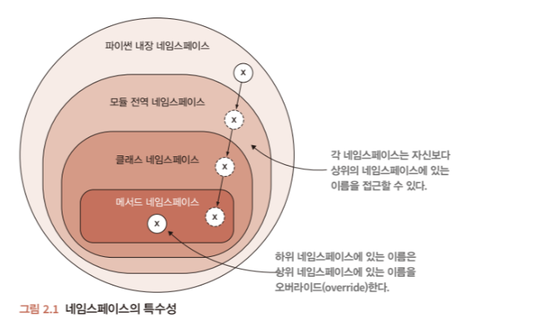

# # 프로그래머를 위한 파이썬 - 2.1장
> namspace

## 관심사 분리.
* 관심사 분리의 기준
    * 응집도(Cohesion) : 서로 비슷한 일하는 code끼리 잘 분리되어 있는가?
    * 결합도(Coupling) : 코드가 얼마나 독립적인인지 확인, 본인이 맡은 일을 하기 위해 외부 코드의 도움이 덜 필요할수록 좋음.
    * 하지만, 평가 기준이 정확한 기준이 없기 대문에 추상적이다.

### Clear code
* Clear code : 가독성이 좋고, 이해가 쉬운 코드.
    * 명확한 의도를 가진 짧은 코드를 만드는 것은 중요하지만, 임의의 기준으로 분할해서는 안된다.
    * 관심사에 따라 나누는 것이 효과적.(Separataion of Concerns)
        * 관심사(Concern) : software가 다루는 독립적인 행동이나 정보.
    * 함수는 최대한 작게, 한가지 일만 하도록 할 것.
        * 함수가 보통 20줄이 넘어가면 안된다.
    * 너무 길거나, 추상화의 '단(level)'이 맞지 않는 함수를 코드를 빼내 별도의 함수로 만듬.

### Namespace(네임스페이스)
* namespace : 프로그래밍 언어에서 특정 객체(obeject)를 이름에 따라 구분할 수 있는 범위 의미.
    * 특정한 하나의 이름이 통용될 수 있는 범위를 제한
    * 소속된 namespace가 다르다면, 같은 이름이 다른 객체를 가리키도록 하는 것이 가능하다.
* 파이썬도 다른 언어들과 마찬가지로 namespace 개념으로 코드르 분리한다.
* namespace의 장점
    * software의 규모가 커지면, 비슷하거나 동일한 이름이 software 이곳저곳에 필요한데 namespace는 충돌을 최소하하여 어떤 이름이 어떤것을 나타내는지 분명하게 해줌.
    * software가 커지면, 해당 code가 이미 존재하는지 파악이 어려움. namespace가 어디에 있는지 추측할 수 있게 해줌.
    * 거대한 기존 코드에, 새로운 code를 입력할 때, 기존의 namespace를 통해 어디에 적으면 좋은지 파악할 수 있으며, 만약 결정할 수 없다면 새로운 namespace를 만드는 것이 좋다.
* Zen of Python
    * `import this`실행 시 마지막 문장에 **Namespaces are one honking great idea -- let's do more of those!** 로 번역하면, 네임스페이스는 매우 훌륭한 아이디어다. -많이 사용하자!로 네임스페이스의 유용성을 적은 [Tim Peters](https://en.wikipedia.org/wiki/Tim_Peters_(software_engineer)) 문구가 있다. 

#### Namespace와 import
* python 인터프리터를 처음 실행하면, 내장된 namespace는 python에 내장된 모든 것들로 채워짐.
    * 이 namespace에는 내장 함수 print(), open() 등이 포함됨.
    * 접두어 필요없고, 바로 사용할 수 있다. `print('Hello World!')`
* python은 namespace를 명시적으로 만들지 않을 수 있다.
    * 이 때, 생성된 namespace들과 그들이 상호작용하는 방식에 따라 코드 구조가 달라짐.

* 파이썬의 변수, function, class에 대한 참조하기 위한 다음 중 하나에 해당해야함.
    * python 내장 namespace에 존재.
    * 현재 module의 전역 namespace에 존재.
    * 현재 code의 local namespace에 존재.


* 만약, 동일한 이름 사용으로 인한 충돌 시 우선 순위에 대한 그림.  
   

#### 다양한 import 방식.
* receipt.py에서 sales_tax.py 파일의 add_sales_tax의 function을 들고올 떄 다음과 같이 간단히 들고 올 수 있다.

```python
# receipt.py
from sales_tax import add_sales_tax
```
* 위 방식은 add_sales_tax()가 receipt module 전역 namespace에 추가된다.
* 만약 sales_tax 많은 함수를 가져오려면 다음과 가팅 할 수 있다.

```python
# receipt.py
from sales_tax import add_sales_tax, add_sate_tax, add_city_tax, ...

# or
from sales_tax import (
    add_sales_tax,
    add_state_tax,
    add_city_tax,
    ...
)

# or 
import sales_tax # sales_tax의 모듈 전체를 불러올 수 있음.
```
* 마지막의 `import sales_tax`는 sales_tax module전체가 현재의 namespace에 추가된다.
* `sales_tax`를 접두어를 사용하여 호출할 수 있고, 이러한 접두어로 namespace 충돌을 방지할 수 있다.

#### namespace 충돌 방지.
* 접두어 
    * `import sales_tax`와 같이 모듈 전체를 불러오는것은 namespace를 충돌을 방지할 수 있다.
    ```python
    import time
    import datetime
    now1 = time.time()
    now2 = datetime.time() 
    ```
    * 위의 now1,now2는 각각 time()을 사용하는데 now1은 time의, now2는 datetime의 time이라는것을 접두어를 통해 확실히 알 수 있다.

* as 키워드
    * 하지만 여전히 접두어를 사용하는 방식은 뜻은 명확해지지만, 작성자의 입장에서는 불편할 수 있다.
    * 이에 대한 방법으로 충돌나는 이름을 다른 이름으로 변경해서 사용하는 방식이 있다.
    ```python
    from time import time as tim1
    from datetime import time as tim2
    now1 = tim1()
    now2 = tim2()
    ```
    * 위 as를 통해 이름을 변경하여, 충돌을 방지하고 뜻을 명확히 구분해서 사용할 수 있다.

* 확실한 이유가 없다면 python의 내장 함수를 override를 하지않는 것이 좋다.
* 다르게 생각해보면, 내장 함수와 같은 이름을 사용하지 않는 것이 위의 문제를 방지할 수 있다.
* 만약에 실수라도 내장 함수의 이름으로 사용했다면, 해당 모듈을 불러오는 과정에서 접두어를 사용하거나 as키워드를 통해 이름을 변경하여 들고오는 방식으로 해결할 수 있다.


[참고링크1](https://hcnoh.github.io/2019-01-30-python-namespace)  
[참고링크2](https://velog.io/@eddy_song/separation-of-concerns)