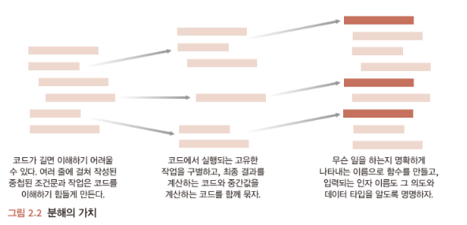

# 프로그래머를 위한 파이썬 - 2.1장
> 관심사 분리

## 관심사 분리(separation of concerns, SoC)
* 관심사 분리: Code가 단위별로 하나의 관심사(기능)에 충실할 수 있도록 만드는 것.
* 분해 : 어떤 문제를 관리하기 쉬운 작은 조각으로 나누는 과정.  
  
* 관심사 분리가 잘 이루어졌다면, code 파악을 위해 읽어야하는 code 단위가 적고, 다른 동작들과 상관없이 code 개선 및 수정이 가능하다.
* 관심사 분리에 대한 절대적인 규칙이 있는건 아니다.
    * 가장 중요한 목표는 비슷한 동작을 묶으며, 서로 다른 동작은 독립적으로 격리하는 것.
* 관심사 분리를 위한 도구로 함수, 클래스, 모듈 이 존재.

### 함수 
* 우리가 코드를 나누려고 할 때 가장 먼저 생각나는 간단한 도구.
* 함수를 생성하는 건은 어떤 작업을 하는지 더 명확하게 해줌.

* 함수를 통한 분해 예시
    * 코미디 극단의 맴버 이름을 입력받아 라인업을 소개하는 문자열을 생성하는 작업을 진행.
    ```python
    names = ['Larry', 'Culry', 'Moe']
    message = 'The Three Stooges: '
    for index, name in enumerate(names):
        if index > 0:
            message += ', '
        if index == len(names) - 1:
            message +=  'and '
        message += name
    print(message)
    ```
    * 만약 라인업이 매번 달라진다고 한다면
    ```python
    names = ['Moe', 'Larry', 'Shemp']
    message = 'The Three Stooges: '
    for index, name in enumerate(names):
        if index > 0:
            message += ', '
        if index == len(names) - 1:
            message +=  'and '
        message += name
    print(message)

    names = ['Larry', 'Culry', 'Moe']
    message = 'The Three Stooges: '
    for index, name in enumerate(names):
        if index > 0:
            message += ', '
        if index == len(names) - 1:
            message +=  'and '
        message += name
    print(message)
    ```
    * 위에서 동일한 작업을 두번 진행하고 있으니 이를 함수로 바꾸면 다음과 같다.
    ```python
    def introduce_stages(names):
        message = 'The Three Stooges: '
        for index, name in enumerate(names):
            if index > 0:
                message += ', '
            if index == len(names) - 1:
                message +=  'and '
            message += name
        print(message)
    introduce_stages(['Moe', 'Larry', 'Shemp'])
    introduce_stages(['Larry', 'Curly', 'Moe'])
    ```
    * 그런데, 갑자기 원래 공연하던 타이틀이 하나였는데 2갠로 늘어버리면, 다음과 같이 코드를 작성할 수 있다.
    ```python
    def introduce_stages(title, names):
        message = f'{title}: '
        for index, name in enumerate(names):
            if index > 0:
                message += ', '
            if index == len(names) - 1:
                message +=  'and '
            message += name
        print(message)
    introduce_stages('The Three Stooges', ['Moe', 'Larry', 'Shemp'])
    introduce_stages('Teenage Mutant Ninja Turtles', ['Larry', 'Curly', 'Moe'])
    ```
    * 모든 작업이 완료되었지만, 아직 끝난게 아니라 그룹명과 이름으로 소개 문구를 구성해야한다.
    ```python
    def join_names(names):  # <1>
    name_string = ''

    for index, name in enumerate(names):
        if index > 0 and len(names) > 2:
            name_string += ','
        if index > 0:
            name_string += ' '
        if index == len(names) - 1 and len(names) > 1:
            name_string += 'and '
        name_string += name
    return name_string

    def introduce(title, names):  # <2>
        print(f'{title}: {join_names(names)}')
    ```
    * 이렇게까지 분리하는 건 너무 과도하게 진행한것 같지만, 각 관심사를 함수로 분리하는 분해는 나중에 버그 수정, 기능 추가 후 코드를 테스트할 때 많은 도움을 준다.


